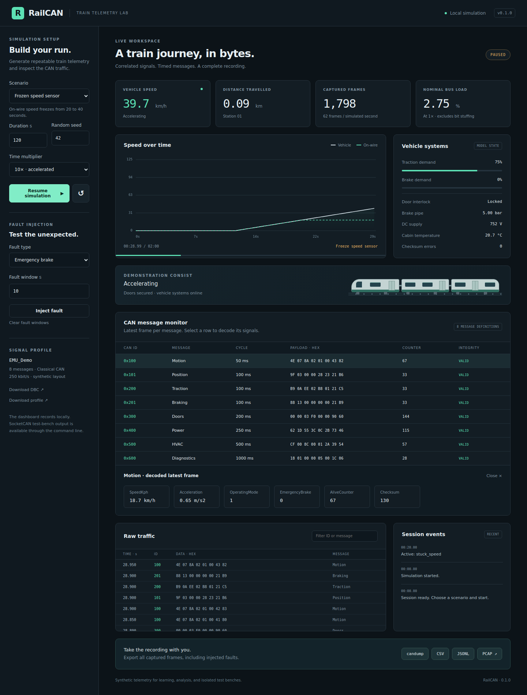

# RailCAN

**Generate train telemetry. Inspect the CAN traffic. Keep the recording.**

RailCAN is a dependency-free Python simulator for correlated train telemetry over Classical CAN. It provides a local dashboard, repeatable journey scenarios, timed fault injection, an editable signal profile, trace replay, and optional Linux SocketCAN transmission.

The included `EMU_Demo` layout is synthetic. It is useful for parser development, dashboard demos, message monitoring, and isolated CAN test benches. It does not reproduce an OEM train protocol, implement CANopen, or claim IEC 61375 conformance.



## Quick start

Install **Python 3.10 or newer**, download or clone this project, and open a terminal in its folder:

```bash
python -m railcan ui
```

On Windows, you can also double-click **`start_windows.bat`**. On macOS use `python3 -m railcan ui`, or `start_macos.command`; on Linux use `./start.sh`.

The dashboard opens at **http://127.0.0.1:8765**. Choose a scenario and press **Start simulation**. Pause/resume preserves the capture; reset starts a new capture. Exports contain every frame captured in the current run, not just the visible frame log. Export a recording before resetting or closing the server; session captures are temporary.

If port 8765 is busy:

```bash
python -m railcan ui --port 8766
```

No CAN hardware, account, internet access, or third-party Python package is needed for the simulator and dashboard. The UI runs in your local browser; this release is Python software, not a bundled standalone executable.

## What it generates

| Message | CAN ID | Cycle | Signals |
|---|---:|---:|---|
| Motion | `0x100` | 50 ms | Speed, acceleration, operating mode, emergency brake |
| Position | `0x101` | 100 ms | Distance and target speed |
| Traction | `0x200` | 100 ms | Motor RPM, traction demand, motor temperature |
| Braking | `0x201` | 100 ms | Brake pipe/cylinder pressure, demand, parking/emergency flags |
| Doors | `0x300` | 200 ms | Left/right door masks, lock, interlock, obstruction, passengers |
| Power | `0x400` | 250 ms | DC supply, signed current, battery voltage |
| HVAC | `0x500` | 500 ms | Cabin/ambient temperature, HVAC mode, setpoint |
| Diagnostics | `0x600` | 1000 ms | Uptime and fault code |

The default profile emits **62 frames per simulated second**. Each frame has eight data bytes, an 8-bit alive counter, and a demonstrator XOR checksum. The default nominal bus load at 250 kbit/s is 2.753%; the estimate excludes bit stuffing, arbitration delays, retransmissions, and errors.

The train model cycles through station dwell, acceleration, cruising, and braking. Doors and traction are interlocked; speed, distance, RPM, brake demand, and current are related. Thermal behaviour is deliberately simplified. A seed makes the same run reproducible regardless of export format or wall-clock pacing.

## Record, decode, and replay

```bash
# Generate two minutes of normal service, quickly and offline.
python -m railcan simulate --duration 120 --seed 42 --out normal.log

# A Wireshark-readable SocketCAN PCAP.
python -m railcan simulate --scenario emergency_stop --out emergency.pcap

# Frozen sensor readings, with decoded signals in JSONL.
python -m railcan simulate --scenario sensor_fault --out sensor.jsonl

# Analyse gaps, checksum errors, and alive-counter anomalies.
python -m railcan inspect sensor.jsonl

# Convert or replay an existing recording.
python -m railcan replay normal.log --out normal.csv

# Export definitions for other CAN tools.
python -m railcan dbc --out railcan.dbc
```

Supported recordings: candump compact `.log`, `.csv`, `.jsonl`, and Classical SocketCAN `.pcap` (link type 227). Replay accepts those formats, retains timestamps and payloads, and can optionally pace and transmit frames. CAN FD, RTR/error frames, BLF, ASC, and PCAPNG are outside this release.

## Journey and fault scenarios

`normal`, `depot`, `emergency_stop`, `door_obstruction`, `hvac_overheat`, `low_voltage`, `sensor_fault`, `message_dropout`, `checksum_error`, and `counter_freeze` are built in.

```bash
python -m railcan scenarios
python -m railcan simulate --duration 100 --faults examples/faults.json --out mixed.jsonl
```

The dashboard also injects finite faults into an active or paused session. The chart separates model speed from the on-wire speed reading, making sensor freezes and spikes visible. Fault injection alters the simulated state or data; it does not generate electrical CAN errors.

## Customise the train and signal layout

```bash
python -m railcan profile --out train-profile.json
# Edit train parameters, CAN IDs, cycles, scaling, or signal positions.
python -m railcan validate train-profile.json
python -m railcan ui --profile train-profile.json
python -m railcan simulate --profile train-profile.json --out custom.log
python -m railcan dbc --profile train-profile.json --out custom.dbc
```

Profiles use little-endian signals in the first six bytes. Byte 6 is the counter; byte 7 is the checksum. CAN IDs may be 11-bit or 29-bit. Message periods are multiples of the 10 ms simulation tick. Profile validation rejects overlaps, invalid ranges, unknown telemetry sources, duplicate IDs, and excessive nominal bus load. Actual model values must fit the signal's configured physical range; narrowing a range can make a run fail. Built-in frame faults target the `Motion` or `Traction` message names; custom faults can select another compatible message.

## Linux CAN test bench

SocketCAN output uses Linux's native CAN socket API; it has no Python dependency. Configure an interface yourself before transmitting. Start with a virtual interface:

```bash
sudo modprobe vcan
sudo ip link add dev vcan0 type vcan
sudo ip link set vcan0 up

# In a separate terminal, if can-utils is installed:
candump vcan0

# Automatic wall-clock pacing when transmitting.
python -m railcan simulate --socketcan vcan0 --duration 30 --out bench.log
python -m railcan replay bench.log --socketcan vcan0
```

Interface names other than `vcan*` require `--allow-hardware`. Use an isolated, authorised CAN test bench, with its bitrate and termination already configured. Do not transmit this synthetic layout to an operational train. The profile bitrate describes the traffic estimate; RailCAN does not configure the adapter bitrate. Physical adapter transmission on Windows/macOS is not implemented.

See [usage](docs/USAGE.md), [signal definitions](docs/SIGNALS.md), and [architecture](docs/ARCHITECTURE.md) for details.

## Development

```bash
python -m unittest discover -s tests -v
python -m pip install -e .
railcan --help
```

Tests cover byte-level encoding, schedule counts, model invariants, deterministic seeds, timed faults, trace round trips, malformed inputs, replay, local API controls, and export snapshots. GitHub Actions runs tests and builds the package on Linux and Windows. Actual adapter transmission needs a separate CAN test bench.

MIT licensed.

